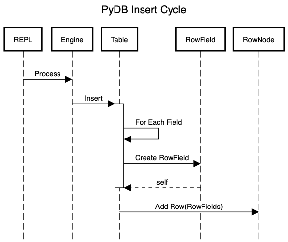

# pydb
Small and simple database written in Python

#  Introduction
I've been curious about how databases work at a fundamental level for a while. You know; what make a database tick? How does the data get stored, what is needed to support multiple tables? How do you parse and execute a SQL statement? 

Well, this is the start of a journey to see how far along this path I can get. I am also using Python because it's popular and I've not written anything this ambitious in Python before.

# Approach

I started using *[Database Internals](https://www.databass.dev)* by Alex Petrov as my main source. But starting from the Binary Tree / B-Tree / B-Tree+ level seemed like missing the point of understanding the higher order operations. It may be necessary to get all the way to the point of managing disk storage that concretely. It may require writing a C module.

I then looked at [tinydb](https://github.com/msiemens/tinydb/tree/master) by Markus Siemens to see if this would give me a leg up.  However, tinydb is a No-SQL database and I'm interested in having a SQL interface. 

Finally though, I've come across [Let's Build A Simple Database](https://cstack.github.io/db_tutorial/parts/part1.html), which starts with the REPL and that seems like a very good place to start.

Following the "Let's Build A Simple Database" approach, I am starting with a REPL and parsing commands directly.

I've started working on a command parser, which is in the SQLParser class in `commands/sql_parser.py`. It currently parses the CREATE statement and returns a dict with the command, table, and a dict of columns. I just noticed that the RowField includes `field_size`, but the SQLParser is just looking for field name and type, so that needs to be addressed. First, however, is to get the SQLParser to parse the input line and return the dict to the Table.create() method and for the table to be dynamically created.

# Design
The top level class will be the REPL, which will create and own the Engine. The Engine owns an array of Tables. The Table owns root RowNode, which is a linked list of RowNodes. When commands are issued, the Engine uses the SQLParser to parse the command and then invokes the corresponding internal action method.

When CREATE is used, the Engine first checks that the table isn't already defined and, if not, then creates the table with the parsed table definition.

When SELECT or INSERT is used (and someday, DELETE and UPDATE), the Engine will find the table and pass the command with parameters to the Table. Below is a sequence diagram of the Insert Cycle:

# Components
## REPL

The REPL (Read, Eval, Print, Loop) will provide the foundation for starting on our database. We'll need a main function that prints a prompt to the screen, reads the input and acts on it. 

To run the repl, use `./pydb.py` from the project root directory

## Engine

The Simple Database reference uses Sqlite, which uses a "." to indicate a meta command, such as `.table` or `.exit`. I don't think I want to do that. I would like to have a meta-table with table data so that one could do `SELECT * from db_tables` and `DESCRIBE <table_name>` to get table details from the meta-table. Therefore, the Engine module can be simpler than the reference, which processes meta commands and SQL commands differently. 
    
## Table
The Table will own a linked list of RowNodes. Each RowNode will contain a RowField, with the name and value of the RowField. The size and type of the RowField is stored in the Table Definition.

# Requirements
1. CREATE <table_name> (<column_name> <column_type>, ...) will create a table with the define table attributes
1. INSERT INTO <table_name> (<column_name1>, ...) VALUES (<value1>, ...) will insert a record into the table with the provided values
1. SELECT * FROM <table_name> will select all the records from the table listed

## Current Functionality
Note: no punctuation. Currently displays a "db: " prompt and accepts the commands indicated below. The table is now defined at creation in the Table class. (That needs to be moved to the user.) Display uses the RowField attributes to display the row field value.

Usage:

1. insert ID Name Email
1. select 
1. exit

### Next Steps
1. Define a size for a Field in Table Create (Done)
1. Build a SQL Parser to parse CREATE, INSERT, and SELECT statements (Done)
1. Persist created table and rows to disk (Done)
	1. I'm getting tired of entering the same SQL commands over and over while testing 😂
1. Fix the parser to capitalize only the key word tokens
1. Fix the parser to support spaces in data values 
1. Constrain data to the field size
1. Display the size of the field in the SELECT output (Done)
	1. In order to do this, I would like `Table.create()` to take a `TableDefinition`. The `TableDefinition` contains the configuration information for each of the columns, called `Field`s. 

